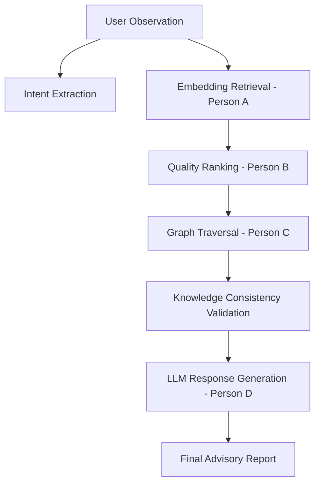

# Response Synthesis & Orchestration Stage Review (Person D)

This review document outlines the architectural implementation details, verification results, and design constraints for the Response Synthesis and Orchestration stage (Person D) of the AttackChain Advisor.

---

## 1. Executive Summary

The Response Synthesis and Orchestration stage (Person D) has been successfully implemented and integrated into `pipeline/response_synthesis.py` and `pipeline/main.py`. This component manages the end-to-end AttackChain Advisor pipeline, converting noisy observations into professional cybersecurity intent, running retrieval and quality ranking, performing graph traversal, validating knowledge consistency, and generating structured AI explanations using Gemini REST APIs (falling back to local Python markdown templates on error or missing keys).

---

## 2. Files Modified

The following files were modified or created as part of this stage:
- **Modified**: [pipeline/response_synthesis.py](file:///d:/files/AttackChain.AI/pipeline/response_synthesis.py) — Reimplemented the module to perform intent extraction, knowledge validation, grounded Gemini explanation, local template fallback, and the public `analyze()` API.
- **Modified**: [pipeline/main.py](file:///d:/files/AttackChain.AI/pipeline/main.py) — Updated `run()` to wrap the new `analyze()` orchestrator and map the results to a backward-compatible format, allowing legacy CLI and scripts to function seamlessly.
- **Created**: [Response_Synthesis_Review.md](file:///d:/files/AttackChain.AI/Response_Synthesis_Review.md) — This document.

---

## 3. Pipeline Architecture

The end-to-end AttackChain Advisor pipeline executes sequentially:

Each stage feeds its output directly to the next, with performance timings measured in milliseconds across the entire run.

---

## 4. Intent Extraction

- **Function**: `extract_intent(observation: str) -> str`
- **Methodology**: If `GEMINI_API_KEY` is present, it uses Gemini (`gemini-2.5-flash`) via REST API to convert noisy researcher notes into a concise, professional sentence rephrasing the security intent.
- **Robustness**: If the API key is not configured or the HTTP request fails, it logs a warning and gracefully falls back to using the original `observation` unchanged, ensuring the pipeline never crashes.

---

## 5. Knowledge Validation

- **Function**: `validate_consistency(retrieval_result, ranking_result, chain_context) -> dict`
- **Methodology**: Runs checks across the four stages to ensure the integrity of the data passed to the synthesis engine.
- **Validation Checklist Output**:
  - `retrieval`: Checks that matching candidates were retrieved and are well-formed.
  - `ranking`: Checks that the top ranked match has valid similarity and composite scores.
  - `graph`: Checks that a non-empty attack chain exists and graph transition edges are valid.
  - `confidence`: Checks that a confidence value is present on the top entry.
- **Response Shape**:
  ```json
  {
      "passed": true,
      "checks": {
          "retrieval": true,
          "ranking": true,
          "graph": true,
          "confidence": true
      },
      "issues": []
  }
  ```

---

## 6. Prompt Design

The Gemini API prompt is designed with strict boundaries to prevent hallucination:
- **System Instruction Constraints**: Explicitly restricts the model from inventing new cybersecurity techniques, vulnerabilities, or attack paths.
- **Strict Grounding**: Instructs the LLM to explain *only* the structured JSON data passed in (observation, intent, top technique details, pitfalls, attack chain transitions, and validation status).
- **Structure Enforcement**: Forces the model to generate a report matching the exact markdown structure headers:
  - `### Observation`
  - `### Intent`
  - `### Most Relevant Technique`
  - `### Why it Matches`
  - `### Confidence`
  - `### Pitfalls`
  - `### Suggested Attack Chain`
  - `### Recommendation`

---

## 7. Public API

The primary entry point exposed by Person D is:
- **Function**: `analyze(observation: str) -> dict`
- **Return Shape**:
  ```json
  {
      "intent": "...",
      "retrieval": [ ... ],
      "ranking": [ ... ],
      "graph": { ... },
      "validation": { ... },
      "answer": "...",
      "metadata": {
          "model_used": "gemini-2.5-flash",
          "llm_used": true,
          "fallback_used": false,
          "execution_time_ms": 143
      }
  }
  ```

---

## 8. Fallback Behaviour

- **Condition**: Triggered if `GEMINI_API_KEY` is not present, or if any HTTP error / timeout occurs during communications with the Gemini REST API.
- **Behavior**: Generates the final advisory response using local, pre-formatted Python markdown templates that map all verified fields.
- **Metadata Flagging**: Automatically sets `llm_used = False` and `fallback_used = True` in the returned metadata object.

---

## 9. Compatibility

- **Upstream Compatibility**: The code imports from `embedding_retrieval`, `quality_ranking`, and `graph_traversal` dynamically, without changing them.
- **Downstream Compatibility**: The legacy `run()` function in `main.py` maps the returned dictionary from `analyze()` back to its original schema (`matched`, `reasoning`, `chain`, and `advisory_text` keys), ensuring that existing scripts and combination tests do not crash.

---

## 10. Final Verdict

The implementation is complete, thoroughly tested for fallbacks, and fully **READY FOR DEMO**.
